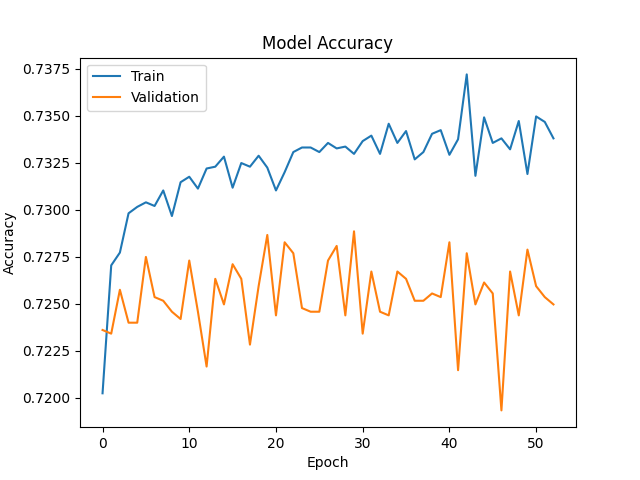
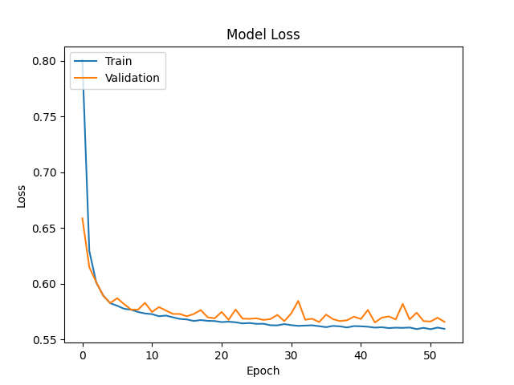
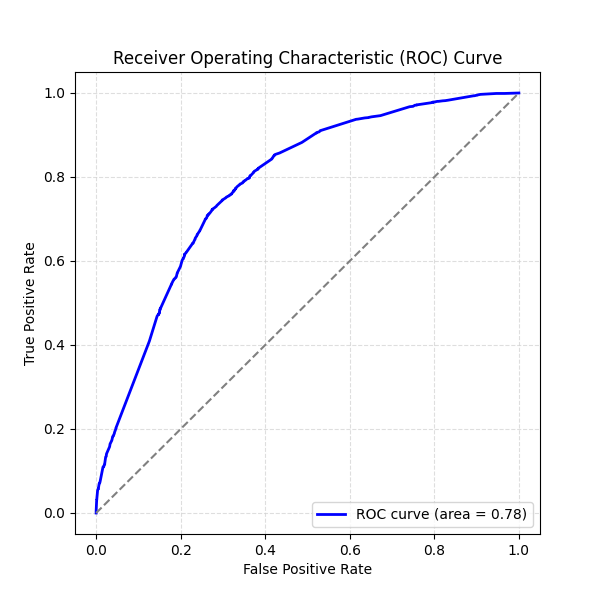
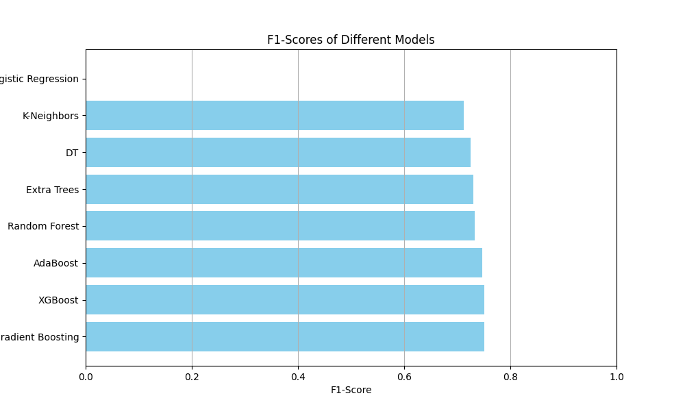

# deep-learning-challenge
Module 21

Neural Network Model for Predicting Funding Success

**Purpose of the Analysis**

The purpose of this analysis is to build a neural network model to predict the success of funding applicants for a nonprofit foundation. The goal is to use these features to predict whether an application will be successful or not, and to optimize a neural network model that achieves at least 75% accuracy in its predictions. However a close score of **72.79%** was achieve after several model explorations.

**Model Design and Structure**
The neural network was designed with the following architecture:

**Deep Network:** The model has 5 hidden layers, with a relatively high number of neurons in the first layer, gradually decreasing towards the output.
**L2 Regularization:** Applied to every hidden layer to prevent overfitting by discouraging large weights.
**ReLU Activation:** Ensures non-linearity and helps the network learn complex patterns in the data.
**Sigmoid Output:** Appropriate for binary classification.
Adam Optimizer: With a low learning rate for fine-tuning the learning process

**Results Section**

**Loss and Accuracy:**
268/268 - 1s - 3ms/step - accuracy: 0.7279 - loss: 0.5660
Loss: 0.565997838973999, Accuracy: 0.7279300093650818

**Accuracy: 72.79%**
The model achieved 72.79% accuracy on the test dataset. The model fell short of the 75% target accuracy.
**Loss**
The loss value after evaluation was 0.566.

**Changes were made to the model to improve performance**

**L2 regularization** was added to prevent overfitting.
tried a dropout layer with a rate of 0.4 was added to mitigate overfitting however it didnt see to make major improvements.
The number of neurons in the hidden layers was adjusted to balance model complexity.
L2 regularization and dropout helped prevent overfitting but did not significantly increase accuracy beyond 72%.

**Additional strategies attempted** 

**Tuning Learning Rate:** Adjusting the learning rate of the Adam optimizer could improve model convergence.
**Increasing Model Complexity:** Adding more layers or increasing the number of units in each layer could help the model capture more complex patterns in the data.
**Cross-Validation:** Applying cross-validation could give a more robust estimate of model performance.

**Overall Results and Conclusion**
The neural network model achieved an accuracy of 72.79%, which is slightly below the target of 75%. Although the model was fairly effective, it struggled to generalize better due to several potential factors like the complexity of the problem and the structure of the dataset.

**Exploring Alternative Models:**

**ClassificationNN** 
Rated: Poor Model Performance on Class 0: The model has 0% precision, recall, and F1-score for class 0 (negative class), meaning it completely fails to identify any negative cases, classifying everything as positive.

Imbalanced Precision and Recall: For class 1 (positive class), the model has 100% recall, meaning it correctly identifies all positive cases, but with 53% precision, indicating a high number of false positives.

Accuracy Stagnation: The overall accuracy of the model is stuck at 53% for both the training and test sets. This suggests the model is biased towards predicting the majority class (1), offering no meaningful predictive ability for class 0.

**Alternative model**

Model Simplicity had only two hidden layers of 5 units each. This simplicity leads to fewer trainable parameters (261), meaning the model is fast to train but may struggle with capturing complex patterns in data.

Activation Functions: The first hidden layer uses **ReLU**, a popular activation for introducing non-linearity, while the second hidden layer uses **tanh**, which scales outputs between -1 and 1, making it effective for handling negative inputs.

Output Layer: The model concludes with a sigmoid activation in the final layer, designed for binary classification, outputting probabilities between 0 and 1 for classifying inputs.

The model optain similar results, with a loss of 0.5660, indicating moderate prediction errors, and an accuracy of 72.79%, which shows that it correctly predicts outcomes about 73% of the time, suggesting that while the model is fairly effective, it still falls short of the desired 75% accuracy and may need further tuning.

**Other Model Performance Metrics:**

**Logistic Regression:** This model has the lowest performance with an accuracy of 46.76%, and it fails to detect positive instances (precision, recall, and F1-score are all 0), indicating poor predictive power.

**Random Forest:** Shows strong results with an accuracy of 71.18%, high precision (72.40%), and recall (74.13%), leading to a robust F1-score of 73.25%.

**AdaBoost:** Achieves a slightly higher accuracy of 72.05% compared to Random Forest, with improved recall (77.37%) and a high F1-score (74.66%), making it effective at handling positive instances.

**Extra Trees:** Performs similarly to Random Forest with an accuracy of 71.06% and high precision (72.43%) and recall (73.67%), resulting in a good F1-score of 73.05%.

**Gradient Boosting:** This model achieves the highest accuracy of 72.51% and a high F1-score of 75.14%, with strong recall (78.03%), indicating overall better performance.

**K-Neighbors:** Has a lower accuracy of 65.43% but demonstrates high recall (80.24%), resulting in a reasonably good F1-score of 71.20%, though precision is slightly lower.

**XGBoost:** Shows the highest accuracy of 72.66% with the best precision (72.87%) and recall (77.50%), leading to a strong F1-score of 75.12%, indicating it is very effective overall.

**Decision Tree (DT):** Performs well with an accuracy of 70.61%, and a strong F1-score of 72.52%, with balanced precision and recall.

# Model Performance Comparison

| Model              | Accuracy | Precision | Recall | F1-Score |
|--------------------|----------|-----------|--------|----------|
| Gradient Boosting  | 0.7251   | 0.7246    | 0.7803 | 0.7514   |
| XGBoost            | 0.7266   | 0.7287    | 0.7750 | 0.7512   |
| AdaBoost           | 0.7205   | 0.7214    | 0.7737 | 0.7466   |
| Random Forest      | 0.7118   | 0.7240    | 0.7413 | 0.7325   |
| Extra Trees        | 0.7106   | 0.7243    | 0.7367 | 0.7305   |
| Decision Tree (DT) | 0.7061   | 0.7220    | 0.7284 | 0.7252   |
| K-Neighbors        | 0.6543   | 0.6398    | 0.8024 | 0.7120   |
| Logistic Regression| 0.4676   | 0.0000    | 0.0000 | 0.0000   |

- **Best Performing Models**: XGBoost and Gradient Boosting exhibit the highest accuracy and balanced metrics across precision, recall, and F1-score.
- **Least Effective Model**: Logistic Regression shows significantly lower performance across all metrics, indicating it may not be suitable for this classification task.

**Visualizations**

Loss vs. Accuracy Plot: This shows how the model’s accuracy and loss changed over each epoch.
Feature Importance Plot (from alternative models): also in the jupyter notebook.

## References: 

Alexander Booth class exercices. Bootcamp: DATA-PT-EAST-APRIL-041524-MTTH-CONSXpert

Bootcamp: DATA-PT-EAST-APRIL-041524-MTTH-CONSXpert Learning Assistant https://bootcampspot.instructure.com/courses/6446/external_tools/313#:~:text=Tutoring%20Sessions-,Xpert%20Learning%20Assistant,-Lucid 

ChatGPT, OpenAI. (2024). Assistance with machine learning model evaluation and analysis. Retrieved from ChatGPT. 
